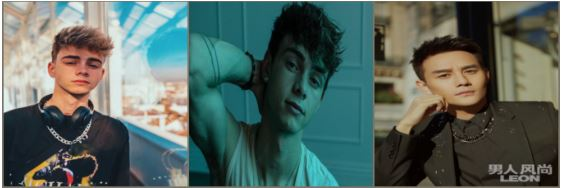
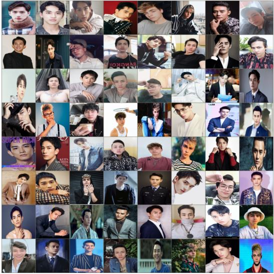
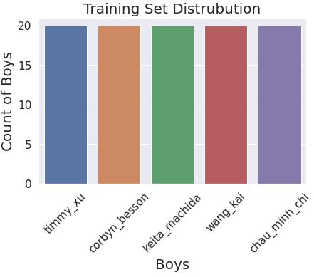

# Pytorch BoysClassifier 🔥

  

### _On this project, I create a custom dataset of 5 male models and conduct a full Pytorch training pipeline. I use a pretrained model and transfer learning, as well as do hyper-parameter search to help increase the accuracy._

## 📺 **Youtube Videos:**

<!-- YOUTUBE:START -->
- [Visualization in image classification.](https://www.youtube.com/watch?v=vzr0pAU0BC0)
- [Full Pytorch training pipeline on image classification task.](https://www.youtube.com/watch?v=tfYR8JMt0xA)
<!-- YOUTUBE:END -->

## **✍️ Analysis and Evaluation:**

### - _Full Pytorch Training Pipeline on Image Classification [part1]_

### - _Full Pytorch Training Pipeline on Image Classification [part2]_

### _📺 My implementations are based off [Aladdin Persson] and [Python Engineer]._

&nbsp;

## **🎲 Repository Content**

### - A training script (using pretrained vgg16 and transfer learning)

### - A script for Hyper-parameter Search

### - A script for loading the model for either resumed training or inference

### - [A trained model] (45% accuracy) 😬

### - Some helper functions

### - A dataset

&nbsp;

## **📰 Dataset Structure**

    train/val
    |___chau_minh_chi
           |___chau_minh_chi_01.jpg
              |___chau_minh_chi_02.jpg
              ...
    |___keita_machida
           |___keita_machida_01.jpg
              |___keita_machida_02.jpg
              ...

&nbsp;

## **Small batch visualization**

&nbsp;

## **Large batch visualization**

&nbsp;

## **Visualize the number of classes**

&nbsp;

## **😑 Hyper-parameter Search**

&nbsp;

## **💥 Training Epochs**

    ==> Saving new best
    Epoch 1/25
    Step 34/34, train Loss = 1.84,  train Acc = 0.29
    Step 20/20, val loss = 1.58,  val acc = 0.25
    Time spent for this epoch -----> 0m 32s

    ==> Saving new best
    Epoch 2/25
    Step 34/34, train Loss = 0.91,  train Acc = 0.63
    Step 20/20, val loss = 1.53,  val acc = 0.43
    Time spent for this epoch -----> 0m 13s

    ==> Validation accuracy did not improve.
    Epoch 3/25
    Step 34/34, train Loss = 0.61,  train Acc = 0.82
    Step 20/20, val loss = 1.67,  val acc = 0.27
    Time spent for this epoch -----> 0m 8s

&nbsp;

## **😌 Visualize Loss and Accuracy**

&nbsp;

## **😅 Accuracy of Each Class**

    Test Acc
    Got 13/30 correct samples over 43.33%
    Accuracy of timmy_xu: 33.33%
    Accuracy of corbyn_besson: 62.50%
    Accuracy of keita_machida: 16.67%
    Accuracy of wang_kai: 30.00%
    Accuracy of chau_minh_chi: 100.00%

&nbsp;

## **😞 Classification Report and Confusion Matrix Heatmap**

&nbsp;

## **😍 Predict a single image**

&nbsp;

## **😐 Prediction In Batch**

[part1]: https://blogbybao.wordpress.com/2022/02/13/full-pytorch-training-pipeline-on-image-classification-task/
[part2]: https://blogbybao.wordpress.com/2022/02/14/full-pytorch-training-pipeline-on-image-classification-task-part2/
[aladdin persson]: https://www.youtube.com/playlist?list=PLhhyoLH6IjfxeoooqP9rhU3HJIAVAJ3Vz
[python engineer]: https://www.youtube.com/playlist?list=PLqnslRFeH2UrcDBWF5mfPGpqQDSta6VK4
[a trained model]: https://drive.google.com/file/d/1-liCPmZJwdZ-ymBap13gpLSxwfms5PmP/view?usp=sharing
