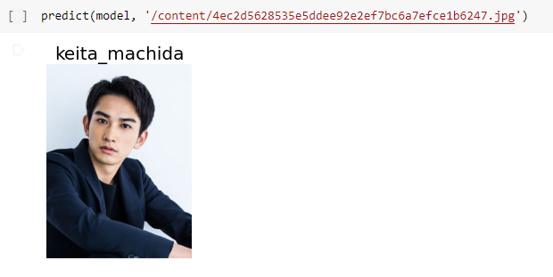

# image_classification on boys dataset

### _On this assignment, I create a custom dataset of 5 male models. I conduct a full pytorch training pipeline, implement the model architecture, and do hyper-parameter search to help increase the accuracy._

&nbsp;

### Everything from tutoring, analysis, to evaluation is documented here. Please check them out for yourself.

### - _Full Pytorch training pipeline on image classification task [ part1 ]_

### - _Full Pytorch training pipeline on image classification task [ part2 ]_

&nbsp;

### _Most of my implementations are based off [Aladdin Persson] and [Python Engineer]. Definitely check them out!_

&nbsp;

## In this repository, there are:

### - a main script for training (using the pretrained googlenet and parameter freezing).

### - a script for tuning (i.e: hyperparameter search and testing out with different models).

### - a script for loading model for inference (showing the results!)

### - trained model for loading (with 67% accuracy).

_Sorry! Don't blame me. Please see my blogs for evaluations._

### - some helper functions on structuring the dataset (i.e: utils)

### - model dataset

&nbsp;

## Dataset structure

    train/val
    |_________chau_minh_chi
              |_________chau_minh_chi_01.jpg
              |_________chau_minh_chi_02.jpg
              ...
    |_________keita_machida
              |_________keita_machida_01.jpg
              |_________keita_machida_02.jpg
              ...

&nbsp;

## Some results

## - **Visualize the dataset**

### I have updated two ways the images could be visualized.

### - One is via the imshow2 function which employs the torchvision.utils.make_grid. This way the images are put next to each other without spaces. Title only looks good when the batch_size of the loader is small (i.e: preferably not 64, only then title is not required). Right above!

### - Two is via the imshow1 function which divides the plt in subplots. This way is preferable when title is needed for each image (i.e: visualize the model output). The images are separated by spaces and require the input of num_row and num_col of the grid. See below!

&nbsp;

## - **Hyper-parameter search**

&nbsp;

## - **Training epochs**

    Epoch 126/200
    Step 33/33, train loss = 47.72,  train acc = 59.35
    Step 15/15, val loss = 1.58,  val acc = 0.48
    Time spent for this epoch -----> 0m 9.10s

    Epoch 127/200
    Step 33/33, train loss = 48.20,  train acc = 60.23
    Step 15/15, val loss = 1.47,  val acc = 0.52
    Time spent for this epoch -----> 0m 9.08s

    Epoch 128/200
    Step 33/33, train loss = 48.80,  train acc = 60.99
    Step 15/15, val loss = 1.59,  val acc = 0.45
    Time spent for this epoch -----> 0m 9.03s

&nbsp;

## - **Validation accuracy**

&nbsp;

## - **Validation loss**

&nbsp;

### - **Check accuracy**

    Test Acc
    Got 13/30 correct samples over 43.33%
    Accuracy of timmy_xu: 33.33%
    Accuracy of corbyn_besson: 62.50%
    Accuracy of keita_machida: 16.67%
    Accuracy of wang_kai: 30.00%
    Accuracy of chau_minh_chi: 100.00%

&nbsp;

## - **Predictions**

&nbsp;

## - **Classification report and confusion matrix heatmap**

&nbsp;

## - **Predictions in batch**

[part1]: https://blogbybao.wordpress.com/2022/02/13/full-pytorch-training-pipeline-on-image-classification-task/
[part2]: https://blogbybao.wordpress.com/2022/02/14/full-pytorch-training-pipeline-on-image-classification-task-part2/
[aladdin persson]: https://www.youtube.com/playlist?list=PLhhyoLH6IjfxeoooqP9rhU3HJIAVAJ3Vz
[python engineer]: https://www.youtube.com/playlist?list=PLqnslRFeH2UrcDBWF5mfPGpqQDSta6VK4
