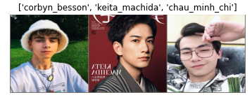
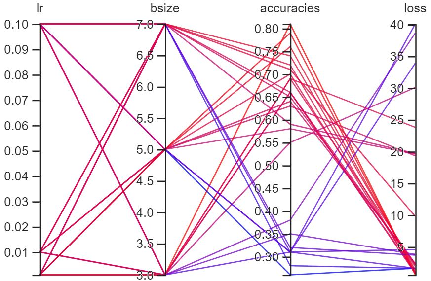
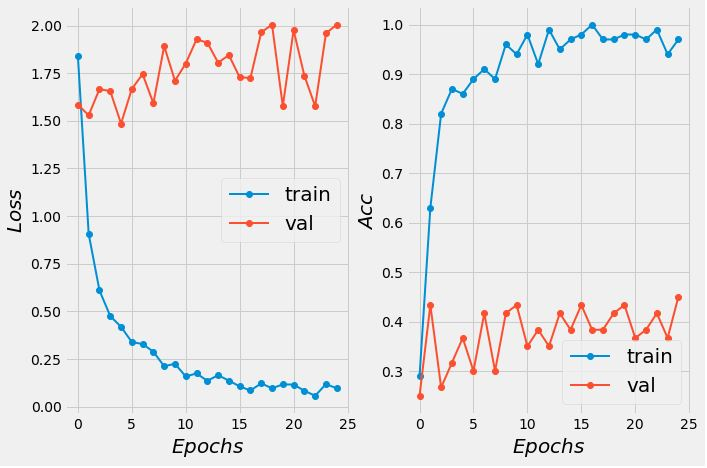
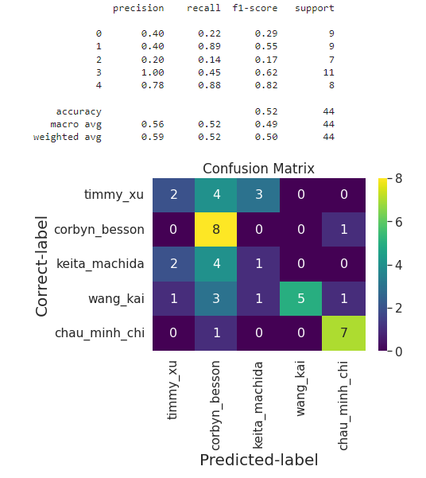
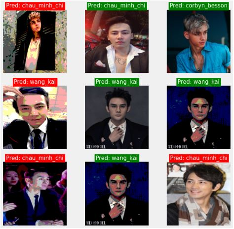

# image_classification on boys dataset

### _On this assignment, I create a custom dataset of 5 male modelsin a full pytorch training pipeline. I use a pretrained model and transfer learning, as well as do hyper-parameter search to help increase the accuracy._

&nbsp;

### Analysis and evaluation are documented here.

### - _Full Pytorch training pipeline on image classification task [ part1 ]_

### - _Full Pytorch training pipeline on image classification task [ part2 ]_

&nbsp;

### _Most of my implementations are based off [Aladdin Persson] and [Python Engineer]._

&nbsp;

## In this repository, there are:

### - a main script for training (using the pretrained vgg16 and transfer learning).

### - a script for hyperparameter search.

### - a script for loading the model either for resumed training or for inference.

### - [a trained model] (45% accuracy).

### - some helper functions

### - a dataset

&nbsp;

## Dataset structure

    train/val
    |_________chau_minh_chi
              |_________chau_minh_chi_01.jpg
              |_________chau_minh_chi_02.jpg
              ...
    |_________keita_machida
              |_________keita_machida_01.jpg
              |_________keita_machida_02.jpg
              ...

&nbsp;

## Results

## - **Visualization**

&nbsp;

## - **Hyper-parameter search**

&nbsp;

## - **Training epochs**

    ==> Saving new best
    Epoch 1/25
    Step 34/34, train Loss = 1.84,  train Acc = 0.29
    Step 20/20, val loss = 1.58,  val acc = 0.25
    Time spent for this epoch -----> 0m 32s

    ==> Saving new best
    Epoch 2/25
    Step 34/34, train Loss = 0.91,  train Acc = 0.63
    Step 20/20, val loss = 1.53,  val acc = 0.43
    Time spent for this epoch -----> 0m 13s

    ==> Validation accuracy did not improve.
    Epoch 3/25
    Step 34/34, train Loss = 0.61,  train Acc = 0.82
    Step 20/20, val loss = 1.67,  val acc = 0.27
    Time spent for this epoch -----> 0m 8s

&nbsp;

## - **Loss and accuracy**

&nbsp;

## - **Evaluation**

### **Accuracy of each class**

    Test Acc
    Got 13/30 correct samples over 43.33%
    Accuracy of timmy_xu: 33.33%
    Accuracy of corbyn_besson: 62.50%
    Accuracy of keita_machida: 16.67%
    Accuracy of wang_kai: 30.00%
    Accuracy of chau_minh_chi: 100.00%

&nbsp;

### **Classification report and confusion matrix heatmap**

&nbsp;

## - **Predictions**

### **Single**

&nbsp;

### **In batch**

[part1]: https://blogbybao.wordpress.com/2022/02/13/full-pytorch-training-pipeline-on-image-classification-task/
[part2]: https://blogbybao.wordpress.com/2022/02/14/full-pytorch-training-pipeline-on-image-classification-task-part2/
[aladdin persson]: https://www.youtube.com/playlist?list=PLhhyoLH6IjfxeoooqP9rhU3HJIAVAJ3Vz
[python engineer]: https://www.youtube.com/playlist?list=PLqnslRFeH2UrcDBWF5mfPGpqQDSta6VK4
[a trained model]: https://drive.google.com/file/d/1-liCPmZJwdZ-ymBap13gpLSxwfms5PmP/view?usp=sharing
